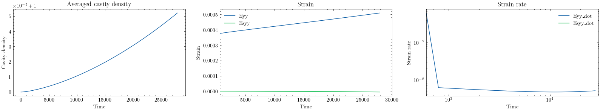

# NH-Coble creep simulations

## 4-grains

### settings

* use 'conservative' nucleation term: $m= (c_{eq}-c)/c_{eq} N_r \exp{(-\frac{Q_v}{RT})}$

* let $c_{eq}=(1+a \boldsymbol{t}\cdot\boldsymbol{e}_n)c_{eq}^0$ on GB, so that we have
 $\dot{\varepsilon}=\eta\Omega(c-c_{eq})>0$. a is some factor...

