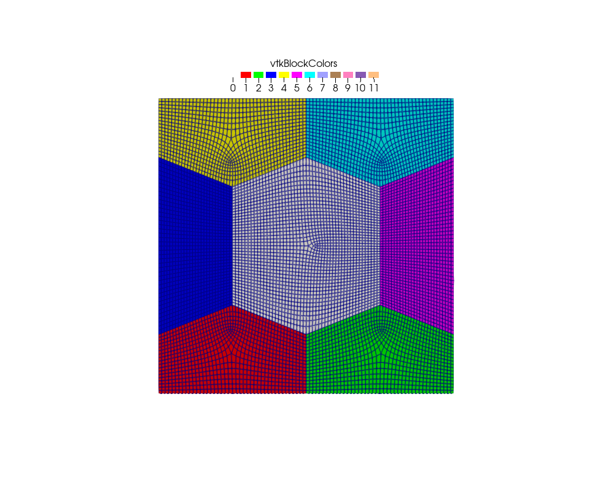
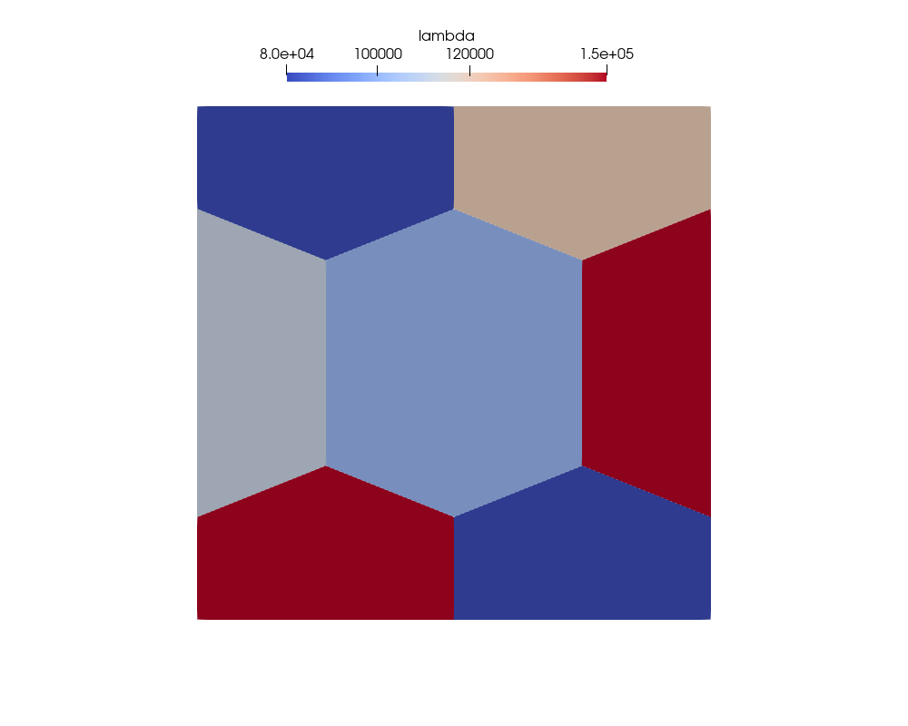
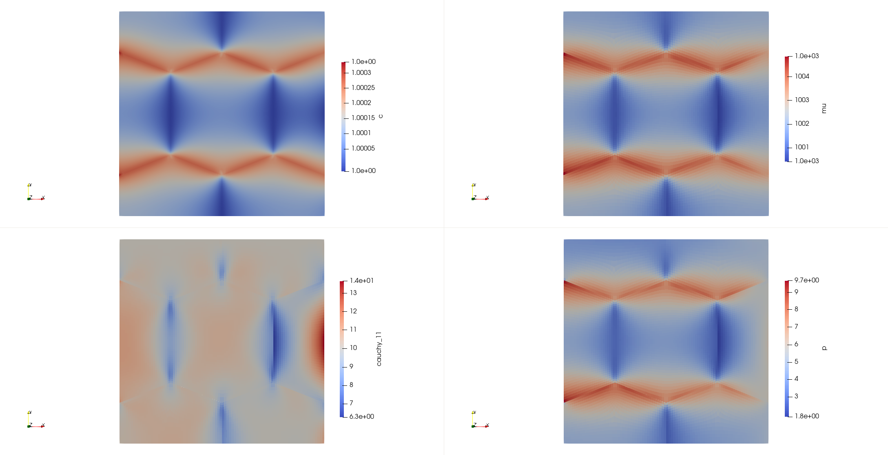
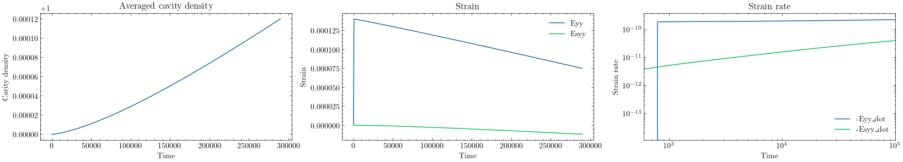
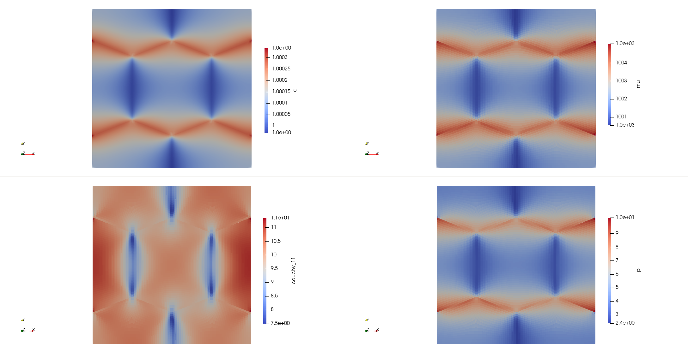
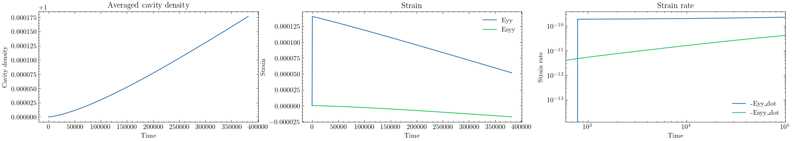

# NH-Coble creep simulations

## 4-grains

### settings

* fix bottom in y, fix left in x, uniform tension on top
* use traction-induced nucleation term: $m= \boldsymbol{t}\cdot\boldsymbol{e}_n N_r \exp{(-\frac{Q_v}{RT})}$
* a) free boundary on right
* b) with equalvaluebc on right, periodic BC for c
* mesh generated with `n=4, h=0.025`, `block ids='grain_0 grain_3 grain_4 grain_5 grain_6 grain_7 grain_8'`
  

* varying lambda
  

### a. free boundary on right

### b. periodic BC for c and equal value BC on top and right

