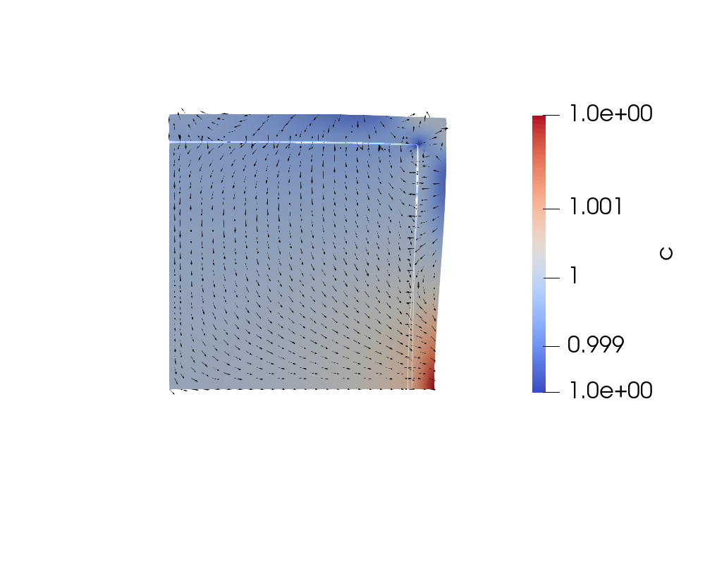

<!-- results summary for NH-Colbe creep simulations on single grain using coupled creep cavitation model -->
<!-- Yangyuanchen Liu -->

# NH-Coble creep

## Single grain

> inlcude a single `interior` grain and a `exterior` grain, with the GB.

### i. with the 'conservative' nucleation on GB

$$
m= (c_{ref} - c)/c_{ref}N_r \exp{(-\frac{Q_v}{RT})},
$$
in which we keep $\int_\Omega\dot{c}=0$ approximately.

* Bulk dominate
  `./gold/single_conserv_load50_Mi1e-16_M1e-11_Nri1e-6.csv`
  
  

* GB dominate
  `./gold/single_conserv_load50_Mi1e-8_M1e-16_Nri1e-3.csv`
  
  

### ii. with the traction-induced nucleation on GB

Now if we turn back to traction-induced nucleation term
$$
m= \boldsymbol{t}\cdot\boldsymbol{e}_n N_r \exp{(-\frac{Q_v}{RT})},
$$
but without the bracket, since we want both source (tension) and sink (compression).

Repeat simulations in i).

* Bulk dominate
  `./gold/single_traction_load50_Mi1e-16_M1e-11_Nri1e-9.csv`
  
  

* GB dominate
  `./gold/single_traction_load50_Mi1e-6_M1e-16_Nri1e-10.csv`
  
  